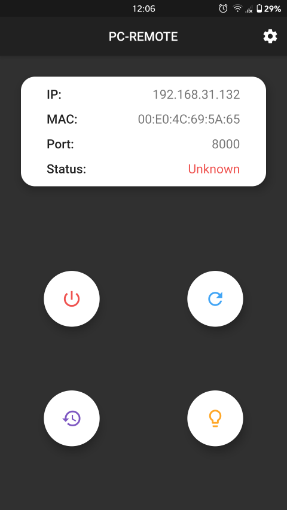

# Pc-Remote

A basic flutter app to shutdown, sleep, restart or wake up a PC on the same network.

---

## Requirements:

- [Airytec Switch Off](http://www.airytec.com/en/switch-off/)
- Both Phone and PC needs to be on the same network.

## Setting up.

- Download and install airytec switch off, on your Windows machine.
- Open airytec settings and **Enable web interface**. (Note: This app currently doesn't support authentication so uncheck the **Enable authentication** in the settings).
- Allow airytec switch off access through windows firewall.
- Assign a static IP Address to your PC.
- To use wake-on-lan enable wake on lan from the bios.
- Install Pc-Remote app on your android device and enter ip address, mac address of your PC and airytec port number in the settings menu.

### Known Issues:

- No authentication support.
- In order to see the changes in settings, you need to restart the app.
- Status will always show unknown.
___
